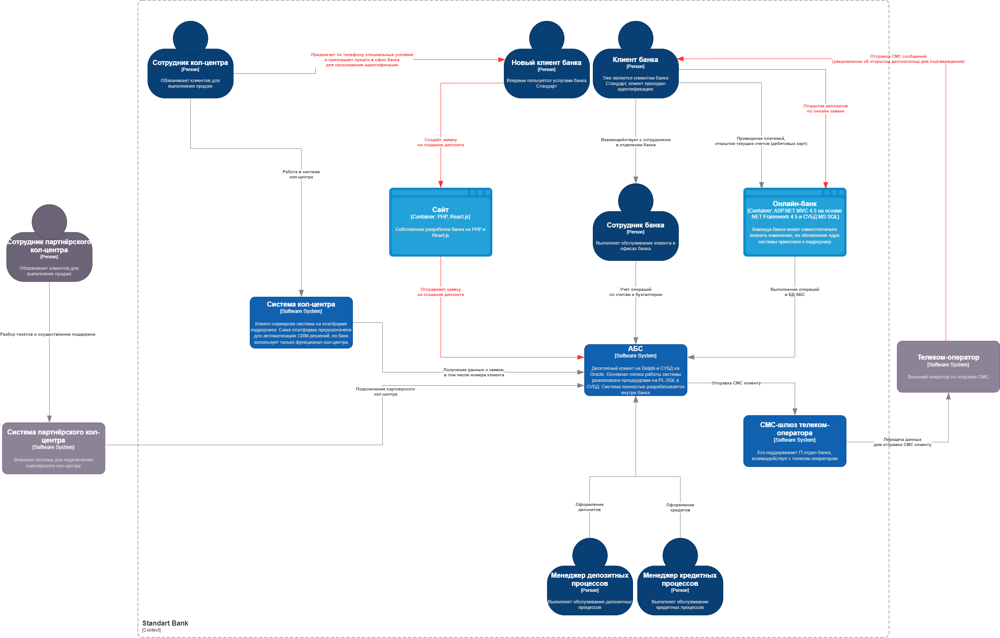
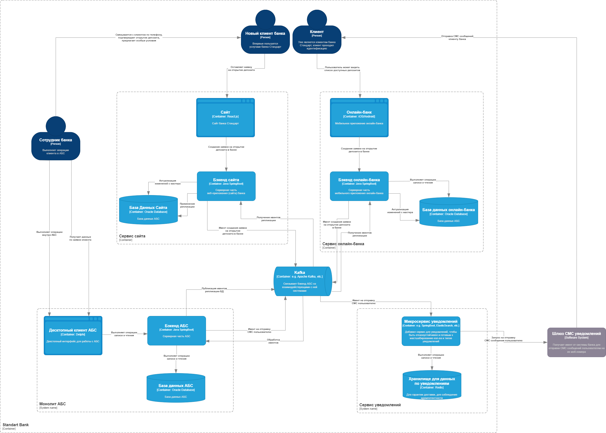

### **Название задачи:** Открытие депозитов онлайн
### **Автор:** Солгалов Никита Юрьевич
### **Дата:** 26.04.2025
### **Функциональные требования**
Опишите здесь верхнеуровневые Use Cases. Их нужно оформить в виде таблицы с пошаговым описанием:

| **№** | **Действующие лица или системы** | **Use Case**                                                                                                                                     | **Описание**                                                                                                                                                                                                                                                                                                                                                            |
|:-----:|:---------------------------------|:-------------------------------------------------------------------------------------------------------------------------------------------------|:------------------------------------------------------------------------------------------------------------------------------------------------------------------------------------------------------------------------------------------------------------------------------------------------------------------------------------------------------------------------|
|  UC1  | Новый клиент                     | Я, как новый клиент банка, могу видеть список доступных депозитов с актуальными ставками на сайте                                                | 1. Клиент заходит на сайт    2. Клиент видит отображение доступных депозитов   3. Ставки по депозитам актуальны                                                                                                                                                                                                                                                 |
|  UC2  | Новый клиент                     | Я, как новый клиент банка, могу оставить заявку на открытие депозита, указав свой номер мобильного телефона на сайте                             | 1. Клиент заходит на веб-форму заполнения заявки на открытие депозита   2. Клиент указывает свой мобильный номер телефона   3. Система валидирует введённые данные клиента                                                                                                                                                                                      |
|  UC3  | Новый клиент                     | Я, как новый клиент банка, должен придти в банк для идентификации личности                                                                       | 1. Клиент подает заявку на открытие депозита   2. Менеджер одобряет заявку   3. Менеджер связывается с клиентом   4. Клиент приходит в отделение банка для идентификациии личности и получения документов                                                                                                                                                   |
|  UC4  | Новый клиент                     | Я, как клиент банка, могу получить специальные условия по заявке на открытие депозита с сайта от менеджера по телефону, после одобрения заявки   | 1. Клиент оформляет депозит на выгодные для банка сроки/суммы 2. Менеджер предлагает клиенту особые условия по телефону                                                                                                                                                                                                                                             |
|  UC5  | Клиент                           | Я, как клиент банка, могу видеть в онлайн-банке список доступных депозитов с актуальными ставками и персонализированными ставками лично для меня | 1. Клиент входит в свою учётную запись  2. Система рассчитывает персонализированные предложения для клиента   3. Онлайн-банк отображает клиенту стандартные и персонализированные предложения по открытию депозита клиенту                                                                                                                                      |
|  UC6  | Клиент                           | Я, как клиент банка, могу указать счёт, сумму депозита и могу подать заявку на открытие депозита в онлайн-банке                                  | 1. Клиент заходит в свою учётную запись онлайн-банка/сайта   2. Клиент указывает в форме счёт, сумму депозита   3. Клиент подаёт заявку на открытие депозита                                                                                                                                                                                                    |
|  UC7  | Клиент                           | Я, как клиент банка, должен подтвердить заявку на открытие депозита через онлайн-банк вводом из СМС сообщения                                    | 1. Клиент оставляет заявку на открытие в онлайн-банке   2. Шлюз система СМС отправляет клиенту код в СМС сообщении   3. Клиент подтверждает заявку на открытие депозита через онлайн-банк вводом кода из СМС сообщения                                                                                                                                          |
|  UC8  | Клиент                           | Я, как клиент банка, должен получить СМС уведомление после подтверждения размера ставки и открытия депозита менеджером                           | 1. Клиент подаёт заявку   2. Менеджер подтверждает заявку   3. Менеджер открывает депозит   4. Клиент получает СМС уведомление                                                                                                                                                                                                                              |
|  UC9  | Клиент                           | Я, как клиент банка, могу выполнять операции на сайте и онлайн-банке за миллисекунды                                                             | 1. Клиент взаимодействует с онлайн-банком или сайтом   2. Любая выполненная операция имеет тайм-аут 1 секунду   3. При возникновении тайм-аута отдаём клиенту неудачный ответ или закэшированные данные, где это целесообразно                                                                                                                                  |
| UC10  | Менеджер                         | Я, как менеджер банка, должен обработать заявку клиента на открытие депозита                                                                     | 1. Клиент подаёт заявку   2. Менеджер обрабатывает заявку клиента                                                                                                                                                                                                                                                                                                   |
| UC11  | Менеджер                         | Я, как менеджер банка, должен перезвонить клиенту, подавшему заявку на депозит                                                                   | 1. Клиент подаёт заявку   2. Менеджер одобряет   3. Менеджер перезванивает клиенту                                                                                                                                                                                                                                                                              |
| UC12  | Менеджер                         | Я, как менеджер банка, должен изучить заявку и предложить при наличии специальные условия клиенту                                                | 1. Клиент подал заявку на открытие   2. Менеджер одобряет заявку   3. Менеджер звонит для подтверждения и предложения особых условий                                                                                                                                                                                                                            |
| UC13  | Менеджер                         | Я, как менеджер банка, должен подтвердить условия депозита в АБС банка                                                                           | 1. Клиент открыл депозит в банке   2. Менеджер зафиксировал изменения в АБС                                                                                                                                                                                                                                                                                         |
| UC14  | Сотрудник бэк офиса кредитов     | Я, как сотрудник, бэк офиса направления кредитов имею возможность работать с XLS-файлами ставок по кредитам                                      | 1. Сотрудник бэк офиса направления кредитов входит в свою учётную запись   2. Сотрудник бэк офиса направления кредитов имеет доступ к нужным операциям в XLS-файле для ведения ставок кредита                                                                                                                                                                       |
| UC15  | Сотрудник бэк офиса депозитов    | Я, как сотрудник, бэк офиса направления депозитов имею возможность работать с XLS-файлами ставок по депозитам                                    | 1. Сотрудник бэк офиса направления депозитов входит в свою учётную запись   2. Сотрудник бэк офиса направления депозитов имеет доступ к нужным операциям в XLS-файле для ведения ставок депозита                                                                                                                                                                    |
| UC16  | Шлюз СМС уведомлений             | Шлюз системы СМС уведомлений должен предоставить клиенту СМС с кодом подтверждения заявки на открытие депозита через онлайн-банк                 | 1. Клиент запрашивает открытие депозита через онлайн-банк   2. Система банка обрабыватывает заявку   3. Система банка триггерит СМС шлюз для отправки кода подтверждения клиенту                                                                                                                                                                                |
| UC17  | Шлюз СМС уведомлений             | Шлюз системы СМС уведомлений должен предоставить клиенту СМС с уведомлением о подтверждении размера ставки и открытии депозита менеджером        | 1. Клиент запрашивает открытие депозита через сайт банка   2. Менеджер открывает после проверки депозит клиенту   3. Менеджер фиксирует изменения по открытию депозита в АБС   4. Система банка треггирит шлюз СМС для отправки уведомления клиенту об открытии депозита в банке и пришглашением посетить офис лично для проведения процедуры идентификации |

### **Нефункциональные требования**
Опишите здесь нефункциональные требования и архитектурно-значимые требования.

| **№** | **Требование**                                                                  |
|:-----:|:--------------------------------------------------------------------------------|
|   1   | Сервисы должны быть доступны 24/7 с доступностью не менее 99,9%                 |
|   2   | Реализовать механизм переключения на резервный ЦОД в случае сбоя                |
|   3   | Время отклика всех операций не более секунды                                    |
|   4   | Минимизировать прямую работу интернет-банка с АБС                               |
|   5   | Оптимизировать работу с базами данных MS SQL и Oracle                           |
|   6   | Шифрование трафика между клиентом, сайтом, интернет-банком и АБС                |
|   7   | Использовать существующий СМС-шлюз телеком-оператора для подтверждения операций |
|   8   | Документировать архитектуру и бизнес-процессы                                   |
|   9   | Использовать существующие технологии банка                                      |

### **Решение**
Приведите диаграммы контекста и контейнеров в модели C4. Опишите там основные компоненты и интеграции всех элементов решения.

### Диаграмма C4 Context

### Диаграмма C4 Container

### Описание:
Для сайта и мобильного приложения банка были добавлены сервисы для разделения зон ответственности и централизованной
логики управления данными. Данные сервисы связываются с монолитом (АБС системой) через Kafka, также сервисы реплицируют
данные из АБС для минимизации зависимости и обращений в API АБС. Дополнительно был спроектирован сервис уведомлений для вызова
API телеком-оператора, также данному сервису сделано хранилище для контроля отправленных уведомлений. 
Гарантии отправки запросов к телеком-оператору выбрали `at least once`.

### **Альтернативы**
Принятые архитектурные решения и логика выбора технологий:
1. Реализация серверных частей для онлайн-банка и сайта   Чтобы избежать прямого доступа из сайта и интернет-банка к базе данных АБС, мы реализуем отдельные серверные приложения (бэкенды) для сайта и онлайн-банка. Это позволит:
    * централизованно контролировать доступ к данным
    * реализовать бизнес-логику, связанную с валидацией и авторизацией
    * обеспечить безопасность и масштабируемость
    * снизить риски, связанные с нагрузкой на критически важную систему АБС
2. Асинхронная обработка событий через шину Kafka   Использование Kafka как шины данных для событийной интеграции между компонентами архитектуры даёт:
    * гибкость в расширении системы (подписка на события без изменения логики)
    * возможность масштабировать систему горизонтально
    * повышение отказоустойчивости (данные сохраняются в брокере)
    * реализацию стратегии повторных попыток (retry) для обработки ошибок
3. Создание отдельных баз данных для сайта и онлайн-банка + репликация данных из АБС   Для снижения нагрузки на АБС и минимизации прямого взаимодействия с ней:
    * выделяются отдельные БД под сайт и интернет-банк
    * реализуется репликация нужных данных из АБС (например, список банковских продуктов, ставки, статусы заявок)
    * предоставляется быстрый доступ к часто используемым данным
    * повышается доступность и скорость отклика пользовательских интерфейсов
4. Реализация микросервиса уведомлений:
    * контроль отправки уведомлений пользователям
    * централизованное управление логикой уведомлений

### **Недостатки**
**Недостатки, ограничения, риски**
Подробно опишите здесь недостатки, ограничения и риски выбранного решения.
1. <b>Увеличение времени и затрат на разработку:</b> внедрение Kafka, отдельные бэкенды и репликация данных потребуют времени и ресурсов
2. <b>Поддержка Kafka:</b> необходим DevOps-инженер/бэк-разработчик с опытом эксплуатации Kafka
3. <b>Риски неконсистентности данных:</b> возможны расхождения между реплицированными данными и актуальной информацией в АБС, особенно при сбоях, ручных изменений данных/структур таблиц, реплика лаги
4. <b>Сложности в реализации и отладке репликации:</b> разработка механизмов синхронизации и их надёжность требует тщательного тестирования
5. <b>Нагрузка на инфраструктуру:</b> требуется дополнительная инфраструктура для работы микросервисов, брокера Kafka, мониторинга и масштабирования
6. <b>Требуется обучение сотрудников:</b> необходимо повысить квалификацию IT-команды по новым технологиям (Kafka, асинхронная обработка, EDA, масштабирование)